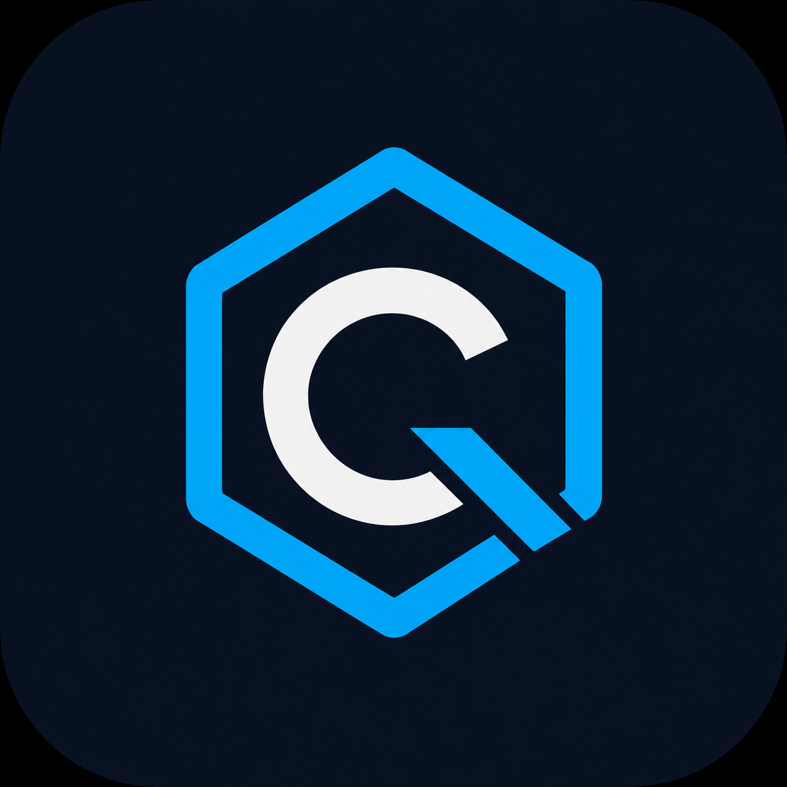
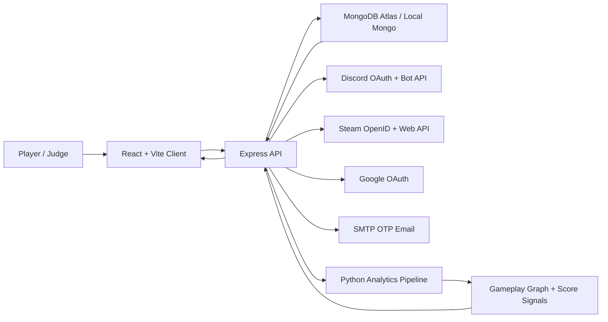

<div align="center">
  
  <h1>ClutchQ</h1>
  <p><strong>Squad intelligence for gamers who want reliable teammates before they queue.</strong></p>
  <p>Verified identity · Steam depth · Discord voice rooms · Gameplay analytics</p>

  <p>
    <a href="https://clutch-q.vercel.app">
      
    </a>
    <a href="https://clutchq-backend.onrender.com/api/health">
      
    </a>
    
  </p>
</div>

---

ClutchQ is a full-stack MERN squad-finder that combines lobby discovery, verified gaming identities, Steam profile depth, Discord voice rooms, session history, and gameplay analytics into one clean matchmaking console.

## Product Snapshot

| Area | What ClutchQ Delivers |
| --- | --- |
| Matchmaking | Game, rank, role, region, language, mic, and availability-aware squad discovery |
| Identity | Email, Google, Discord, and Steam auth paths with account-link visibility |
| Steam Intelligence | Library, recent playtime, achievements, friends, heatmap, and player score |
| Voice | Discord bot-powered lobby voice rooms with reusable invite links |
| Analytics | Gameplay rhythm, scorecards, teammate fit, and Python-backed graph signals |
| Demo Readiness | Seeded players, rooms, games, activity, and polished product flows |

## Product Story

Solo queue is unpredictable because players usually judge teammates with almost no context. ClutchQ solves that by showing the useful signals before a lobby starts:

- What game and role the player actually plays
- Whether their Steam profile is connected and synced
- Recent activity rhythm and session history
- Trust signals from teammate reviews
- Discord voice readiness
- Lobby fit by game, rank, language, region, and play style

The result is a demo-ready product for judges, recruiters, and gamers: open the app, pick a game, find an active room, review teammate signals, and join with confidence.

## Demo Access

Seeded demo accounts can be enabled in the database for live demos.

| Email | Password | Role |
| --- | --- | --- |
| `demo@clutchq.com` | `demo123` | General demo player |
| `captain@clutchq.com` | `demo123` | Lobby host profile |
| `sentinel@clutchq.com` | `demo123` | Defensive role profile |
| `flex@clutchq.com` | `demo123` | Flex teammate profile |

Run the seed script only against the database you intend to modify.

```bash
npm run seed:demo
```

## What Is Built

### Squad Discovery

- Browse games with high-quality game artwork
- Filter lobbies by game, platform, team size, room activity, and type
- Join or request rooms with host, slot, rank, and fit signals
- Dummy/demo rooms are included so the experience looks alive during judging

### Player Profile

- Clean player profile with avatar upload
- Steam connection and sync status
- Library preview, recent games, friends, achievements, and player score
- Clutter-free cards that reveal detail only when useful

### Activity Intelligence

- Gaming rhythm visualized with dates and session history
- Recent session timeline with ratings and notes
- Teammate rhythm recommendations
- Python analytics pipeline hooks for graph and scorecard generation

### Auth And Identity

- Email login and registration
- OTP email verification and password reset flow
- Google OAuth
- Discord OAuth
- Steam OpenID login and profile sync
- Epic Games and Microsoft OAuth placeholders ready for completion

### Discord Voice Rooms

- Lobby owners can create Discord voice rooms
- Accepted members can view and copy invite links
- Rooms are reused instead of duplicated
- Discord health check route validates bot, guild, category, and permissions

### Admin And Moderation

- Admin dashboard routes
- Reports and review flow
- Request management
- User suspension support

## Architecture



### System Layers

| Layer | Responsibility |
| --- | --- |
| `client/` | React UI, route pages, profile console, games, lobbies, activity views |
| `server/` | Auth, profiles, lobbies, requests, reviews, Steam, Discord, analytics API |
| `server/models/` | MongoDB schemas for users, profiles, lobbies, rooms, sessions, reviews |
| `server/services/` | External integrations and reusable business services |
| `server/python/` | Analytics scripts for gameplay graphs and scorecards |
| MongoDB | Persistent users, profiles, lobbies, sessions, synced Steam data |
| Discord | OAuth login and lobby voice room creation |
| Steam | Identity, library, recent playtime, achievements, friends |

## Backend Reliability

The backend has been hardened for a production-style deployment:

- Request IDs are attached to every request and error response
- `/api/health` reports API uptime and MongoDB connection state
- Production env validation catches missing values, placeholder values, weak JWT secrets, and malformed URLs
- MongoDB connection uses bounded server selection time and production-safe indexing behavior
- Common Mongo and JWT errors are normalized into clean API responses
- Server errors are logged with request IDs without leaking stack traces in production
- CORS is allowlisted for localhost, Vercel, and configured origins
- Helmet, cookies, JSON body limits, and rate limiters are enabled
- Graceful shutdown closes HTTP and MongoDB connections on deploy restarts

## API Surface

The API is organized by product domain instead of one giant controller.

| Domain | Base Route | Purpose |
| --- | --- | --- |
| Auth | `/api/auth` | Email, OTP, OAuth, Steam login |
| Profiles | `/api/profile`, `/api/profiles` | Player profile, avatar, account links |
| Games | `/api/games`, `/api/external` | Game catalog and external game metadata |
| Game Rooms | `/api/game-rooms` | Game-based room discovery and Discord voice |
| Lobbies | `/api/lobbies` | Classic lobby creation, joining, Discord voice |
| Requests | `/api/requests` | Teammate and lobby requests |
| Sessions | `/api/sessions` | Tracked play sessions |
| Reviews | `/api/reviews` | Teammate trust scoring |
| Activity | `/api/activity` | User activity timeline and rhythm |
| Intelligence | `/api/intelligence` | Scorecards, graph rebuilds, teammate insights |
| Steam | `/api/steam` | Steam sync, library, achievements, friends, heatmap |
| Discord | `/api/discord` | Discord setup health |
| Admin | `/api/admin` | Moderation and operational views |

## Local Setup

### 1. Install dependencies

```bash
npm run install-all
```

### 2. Configure env files

Copy the examples and fill only the integrations you need.

```bash
copy server\.env.example server\.env
copy client\.env.example client\.env
```

For local development, the important values are:

```env
LOCAL_PORT=5000
LOCAL_MONGO_URI=mongodb://127.0.0.1:27017/clutchq
JWT_SECRET=replace_this_with_a_long_local_secret
CLIENT_URL=http://localhost:5173
LOCAL_CLIENT_URL=http://localhost:5173
SERVER_URL=http://localhost:5000
```

### 3. Start MongoDB

With Docker:

```bash
npm run mongo
```

Or use your own local/Atlas MongoDB URI in `server/.env`.

### 4. Seed demo data

```bash
npm run seed
npm run seed:games
npm run seed:demo
```

### 5. Run the app

```bash
npm run dev
```

The client usually opens on `http://localhost:5173`. If that port is busy, Vite may use `http://localhost:5174`.

## Production Environment

Do not commit `.env` files. Store these in Render, Vercel, or your hosting dashboard.

| Variable | Required | Notes |
| --- | --- | --- |
| `NODE_ENV` | Yes | Use `production` on Render |
| `PORT` | Yes | Render provides this, or use `10000` |
| `MONGO_URI` | Yes | MongoDB Atlas connection string |
| `JWT_SECRET` | Yes | At least 32 characters, never a placeholder |
| `CLIENT_URL` | Yes | Vercel frontend URL |
| `SERVER_URL` | Yes | Render backend URL |
| `GOOGLE_CLIENT_ID` / `GOOGLE_CLIENT_SECRET` | Optional | Enables Google login |
| `DISCORD_CLIENT_ID` / `DISCORD_CLIENT_SECRET` | Optional | Enables Discord login |
| `DISCORD_BOT_TOKEN` / `DISCORD_GUILD_ID` / `DISCORD_CATEGORY_ID` | Optional | Enables Discord voice rooms |
| `STEAM_API_KEY` | Optional | Enables full Steam sync |
| `SMTP_HOST` / `SMTP_USER` / `SMTP_PASS` | Optional | Enables real OTP email |
| `RAWG_API_KEY` / `IGDB_CLIENT_ID` / `IGDB_CLIENT_SECRET` | Optional | Enables richer external game metadata |

## Health Checks

Use these after deployment:

```bash
curl https://clutchq-backend.onrender.com/api/health
curl https://clutchq-backend.onrender.com/api/discord/health
```

Expected API health response:

```json
{
  "success": true,
  "message": "Healthy",
  "data": {
    "database": {
      "state": "connected"
    },
    "environment": "production",
    "requestId": "..."
  }
}
```

## Testing Checklist

Before a demo or deployment:

- Run `npm run build`
- Open `/api/health` and confirm MongoDB is connected
- Login with a seeded demo account
- Register a new email account
- Test Google or Discord login if OAuth env vars are present
- Connect Steam and run Sync Steam
- Create a room and request to join
- Create a Discord voice room if bot env vars are present
- Open Activity and confirm graph/session data loads
- Open Profile and confirm Steam/library/account panels load

## Project Structure

```text
ClutchQ/
  client/
    src/
      assets/
      components/
      pages/
      services/
  server/
    config/
    controllers/
    middleware/
    models/
    python/
    routes/
    scripts/
    seed/
    services/
    utils/
  docker-compose.yml
  package.json
  README.md
```

## Product Proof

ClutchQ is not just a static UI concept. The current build includes deployed frontend/backend services, persistent MongoDB data, real authentication paths, external gaming integrations, Discord room automation, and seeded demo flows for live judging.

| Proof Point | Status |
| --- | --- |
| Frontend deployment | Vercel-hosted React app |
| Backend deployment | Render-hosted Express API |
| Database | MongoDB Atlas/local Mongo support |
| OAuth | Google, Discord, and Steam paths wired |
| Voice rooms | Discord bot API integration |
| Analytics | Node API connected to Python graph/scorecard pipeline |
| Demo mode | Seeded accounts, rooms, games, sessions, and profiles |
| Reliability | Health checks, request IDs, rate limits, safe error responses |

## Engineering Notes

- The frontend stays lightweight: React, Vite, custom CSS, and no heavy UI framework dependency.
- The backend keeps product logic server-side so match, trust, Steam, Discord, and analytics behavior stays consistent.
- Optional integrations fail gracefully, so missing Steam/Discord/SMTP credentials do not take down the whole app.
- Production `.env` values are validated on boot to catch placeholder URLs, weak JWT secrets, and missing core config.
- The README intentionally avoids secrets and only documents variable names, setup shape, and public endpoints.

## Next Milestones

| Milestone | Why It Matters |
| --- | --- |
| Real-time lobby presence | Make rooms feel live without refreshes |
| Epic Games and Microsoft OAuth | Complete the remaining identity providers |
| Scheduled graph refresh | Keep activity and teammate signals fresh automatically |
| CI checks | Protect build quality before deployment |
| Admin analytics | Give moderation and demo operators stronger visibility |

## License

MIT
