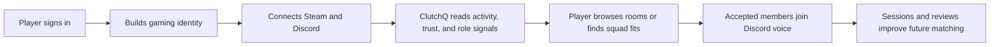
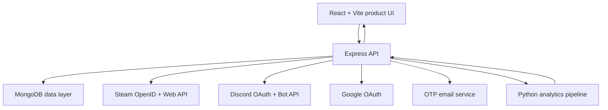

  

  <h1>ClutchQ</h1>

  

    <strong>A premium squad console for gamers who want reliable teammates before they queue.</strong>
  

  

    ClutchQ combines identity, trust, Steam activity, Discord voice, lobby signals, and gameplay rhythm into one clean matchmaking experience.
  

  

    <a href="https://clutch-q.vercel.app"><strong>Live Product</strong></a>
    &nbsp;|&nbsp;
    <a href="https://clutchq-backend.onrender.com/api/health"><strong>API Status</strong></a>
  

---

## The Product

Solo queue is usually a blind decision. Players join with almost no context about role fit, communication, schedule, trust, or whether a teammate is actually active.

ClutchQ turns that unknown into a readable player profile and squad discovery flow. Before joining a room, a player can see the things that matter: game, rank, role, region, mic readiness, trust, Steam depth, recent rhythm, and Discord voice availability.

## What ClutchQ Does

| Product area | What it gives players |
| --- | --- |
| Squad discovery | Find active rooms by game, role, region, rank, language, mic preference, and party style. |
| Player identity | Connect email, Google, Discord, and Steam so profiles feel real and trustworthy. |
| Steam intelligence | Sync public library, recent playtime, achievements, friends, and profile details. |
| Gameplay rhythm | Show recent activity as a clear dated timeline instead of vague playtime numbers. |
| Teammate trust | Use reviews, session history, availability, and profile quality to surface better fits. |
| Discord voice | Create and reuse lobby voice rooms with invite links for accepted members. |
| Product demo | Seeded players, rooms, activity, and profiles make the product feel alive for judging. |

## How It Works

ClutchQ is designed around one simple loop: identify the player, understand their gaming behavior, match them with better teammates, then learn from the session.

## Experience

| Screen | Purpose |
| --- | --- |
| Dashboard | A focused command center with best squad fits and quick match actions. |
| Games | A visual catalog of games, active rooms, and squad categories. |
| Lobbies | Room discovery with fit, host, slots, timing, and request actions. |
| Requests | Incoming and outgoing teammate/lobby decisions in one inbox. |
| Activity | A dated rhythm view showing tracked sessions, game mix, and teammate timing. |
| Profile | Identity, Steam library, linked platforms, score, achievements, and settings. |

## Product Intelligence

ClutchQ does not treat every player as the same profile card. It builds a richer read from multiple signals:

| Signal | Why it matters |
| --- | --- |
| Game and role | Keeps players in rooms where their actual role is useful. |
| Rank and region | Reduces mismatch before anyone joins the lobby. |
| Mic readiness | Helps voice-first squads avoid silent queues. |
| Steam library | Adds proof of game depth and recent activity. |
| Session history | Shows whether a player is consistently active. |
| Reviews and trust | Turns teammate feedback into future matchmaking quality. |
| Availability | Helps squads form when players are actually online together. |

## Architecture

## Built To Feel Complete

ClutchQ is not a static landing-page concept. It includes real product flows across authentication, profiles, games, lobbies, requests, Discord voice rooms, Steam sync, activity analytics, and backend health checks.

| Layer | What is already in place |
| --- | --- |
| Frontend | Premium dark interface, responsive layouts, game artwork, profile menus, and polished dashboard flows. |
| Backend | Auth, profiles, lobbies, requests, reviews, Steam, Discord, activity, intelligence, and admin routes. |
| Data | MongoDB models for users, profiles, rooms, lobbies, sessions, requests, reports, and synced Steam data. |
| Integrations | Google, Discord, Steam, Discord bot voice rooms, OTP email, and external game metadata hooks. |
| Analytics | Gameplay graph, scorecards, teammate fit signals, activity rhythm, and Python-backed processing. |
| Reliability | Request IDs, rate limits, CORS allowlist, safe errors, production env validation, and health endpoints. |

## Product Principles

- Keep the interface premium, quiet, and readable.
- Show the few signals players need before joining.
- Hide deeper data until the player asks for it.
- Make demo data feel believable without pretending it is live production traffic.
- Let integrations fail gracefully instead of breaking the whole product.
- Treat trust, activity, and voice readiness as first-class matchmaking signals.

## Current State

ClutchQ is ready to present as a full-stack product demo: a player can sign in, browse games, inspect teammate fit, join or request rooms, connect Steam, review activity rhythm, and use Discord voice room flows.

The product is built to communicate one idea clearly:

  <h3>Know your squad before the queue starts.</h3>

