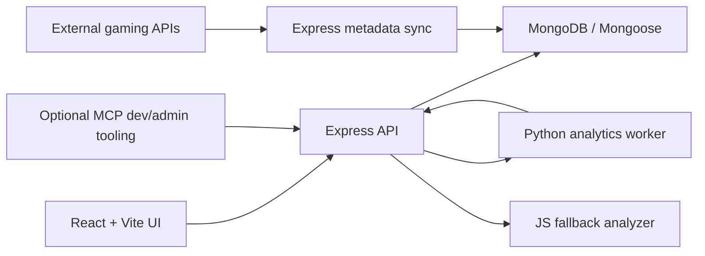

# ClutchQ Architecture

ClutchQ is a MERN application split into a Vite React client and an Express/Mongoose API.

Python is used only as an internal analytics worker. It is launched by the Express API through `child_process`, receives JSON on stdin, writes one JSON response to stdout, and has a JS fallback if unavailable.

## Client

- `src/services/api.js` owns Axios configuration and JWT bearer injection.
- `src/context/AuthContext.jsx` owns session persistence, profile save, demo login, and logout.
- `src/context/ToastContext.jsx` owns lightweight app feedback.
- `src/components/*` contains custom UI only. No external UI component library is used.
- `src/components/intelligence/*` renders scorecard upload, match wrap-up, rhythm, graph, and teammate fit UI.
- `src/pages/*` maps directly to product routes.

## Server

- `server.js` configures CORS, JSON parsing, health checks, and route mounts.
- `models/` defines User, GamerProfile, Lobby, Request, Review, Report, Session, ScorecardAnalysis, ScorecardUpload, TeammateFeedback, and GameplayGraph schemas.
- `controllers/` enforces route behavior and ownership checks.
- `middleware/` provides auth, admin-only access, async handling, and consistent errors.
- `services/analyticsWorkerService.js` runs the Python worker and `services/fallbackAnalyticsService.js` keeps production safe without Python.
- `utils/` contains the matchmaking, chemistry, availability, trust, rank, token, badge, and seed helpers.

## Data Flow

1. User authenticates through `/api/auth`.
2. User creates a profile through `/api/profiles/me`.
3. Dashboard calls `/api/matchmaking/recommendations`.
4. API returns scores plus explanations.
5. React renders score rings, breakdown rows, warnings, heatmaps, and charts.
6. Requests, reviews, lobbies, reports, and sessions update trust and admin analytics.
7. Activity and profile pages call `/api/intelligence/*` for rhythm, scorecard analysis, Gameplay Graph, and teammate fit data.

## Production Intelligence Diagram

The Python worker is internal and optional. If it times out, exits, or is unavailable, Express stores fallback analysis instead of crashing. External APIs are used by sync/cache code only; page loads read MongoDB and built-in catalog fallbacks.

## External Metadata Cache

- `server/services/externalApis/*` owns FreeToGame and optional RAWG calls.
- `ExternalGameMetadata` stores normalized cover, banner, screenshot, genre, platform, release, developer, and publisher data.
- `POST /api/external/games/sync` is admin-only.
- `/api/games` and `/api/games/:slug` apply cached metadata when it exists and otherwise keep using the catalog.

## Optional MCP Boundary

MCP is planned as dev/admin tooling that calls existing Express endpoints. It is not required for users, production gameplay intelligence, lobbies, or the demo path. See `docs/mcp-plan.md`.

## Security

- Passwords are hashed with bcryptjs.
- JWT protects all app routes after login.
- Admin endpoints require both auth and `role === "admin"`.
- Suspended users cannot authenticate.
- Lobby request decisions require lobby owner or request recipient permissions.
